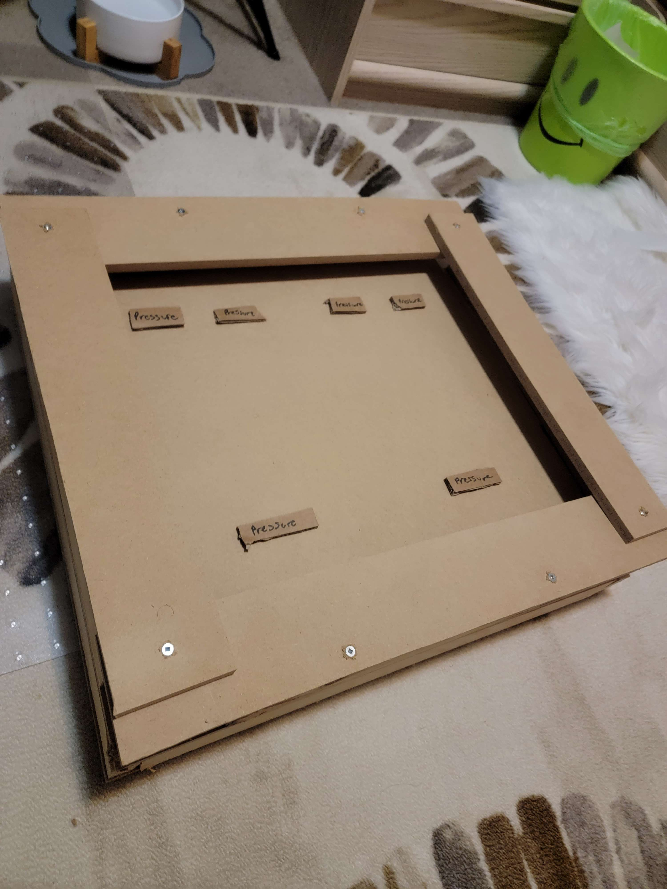
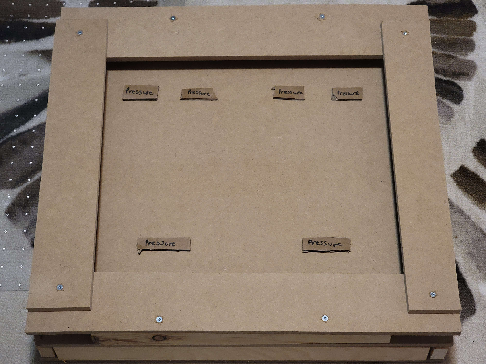
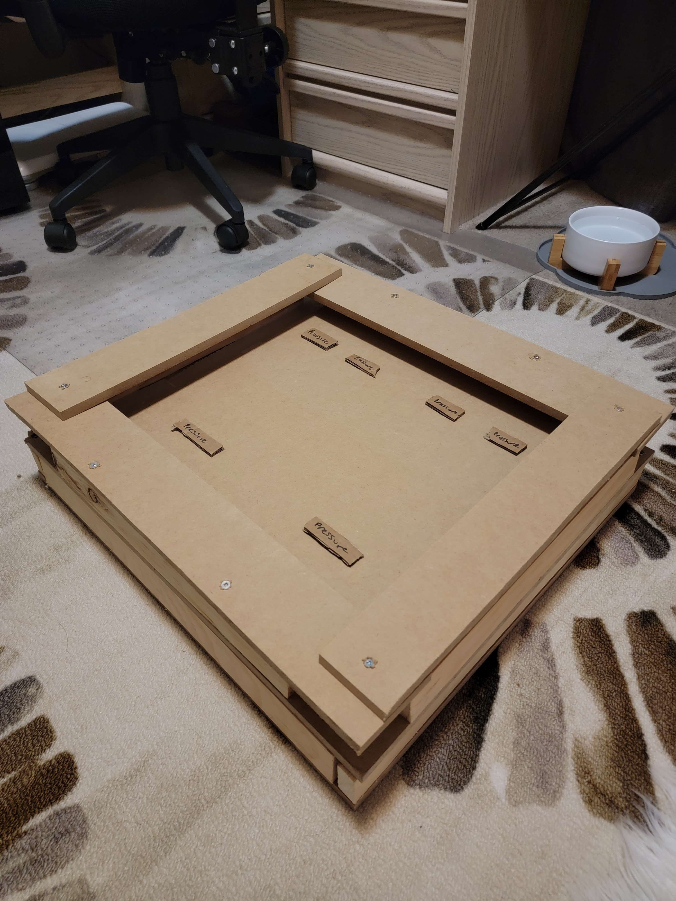
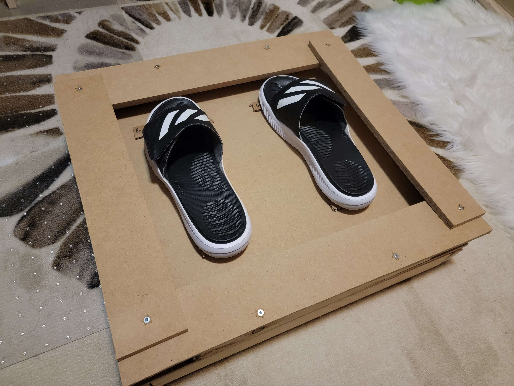
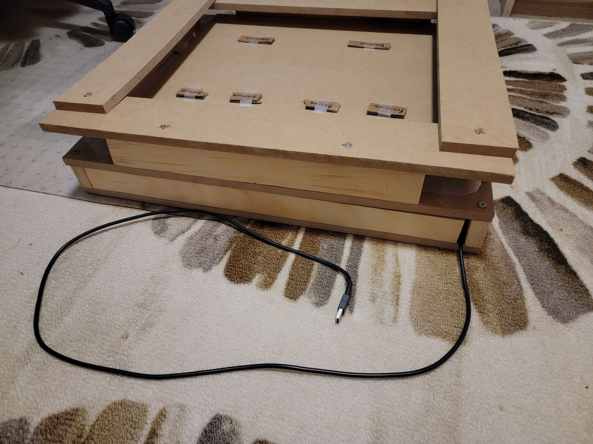

# INFR 3380U - Industrial Design For Game Hardware - Assignment 3

# A Foot Based Game Controller by Atlas X 3

Ame Gilham 100741352

Jackie Zhou 100750922

Ryan Sukhu 100600038

# Information

The slide deck for the video is in the "Video Overview Slide Deck.pdf" file, the video overview itself is linked below, 
the slide deck for the iterative design is in the "Iterative Design Slides.pdf" file, the iterative design video itself 
is also linked below, as are the fabrication, and electronic integration/interactive scene videos. The prototype images 
are in the Images folder as well as below. The description of the Interactive Scene as it is now and the draft for what we will 
make it later is below. And both the Unity files for the Interactive Scenes, and the Arduino code file in .ino format are including
in the repos files.

# Video Overview

Youtube link: [link](link "Youtube")

# Iterative Design

Youtube link: [https://youtu.be/LjTvXzclJ8M](https://youtu.be/LjTvXzclJ8M "Youtube")

# Prototype

# Materials
Our prototype is predominately made out of wood as it is stronger than 3D printed plastic making it more stable while supporting the weight of a user’s legs, and will allow us to build at the scale we need for a controller that users need to place both feet on (3D printing is too small for the scale of our controller). To keep the wood prototype together we used Robertson head screws (square headed screws).

# Fabrication Video

Youtube link: [https://youtu.be/L0_laxKfPNk](https://youtu.be/L0_laxKfPNk "Youtube")

# Interactive Scene And Electronics Integration

Our current interactive scene is a simple red box sprite that can be controlled by input from the joystick, and a green circle that appears when you press a button, both are connected to the Arduino Board. 
The current goal is simply to move around and press the button, and it's purpose is to show users that the current controller has functionality for both button and joystick style input.

Electronics Integration and Interactive Scene Video: [link](link "Youtube")

In the future we will create a simple 2D platformer allowing the player to move left and right (sliding the board), and jump (button). The player will have to avoid 
or destroy enemies, with enemies able to kill the player, and the player winning when they get through all of the enemies to the far right side of the level.
