# INFR 3380U - Industrial Design For Game Hardware - Course Project

# A Foot Based Game Controller by Atlas X 3

Ame Gilham 100741352

Jackie Zhou 100750922

Ryan Sukhu 100600038

# Information

The slide deck for the video is in the "Video Presentation Slide Deck.pdf" file, the video itself is linked below,
as is the video of the demo and interactive scene integration. Both the Unity files for the interactive scene, 
and the Arduino code file in .ino format are including in the repos files. As is the gcode file for our failed
3D print. Images of the the final prototype, electronics integration, timeline, and the technical drawings are 
both below and in the images folder. The report can be found in the IEEE Written Report.pdf file. Finally a 
short summary of the usability and QFD can also be found below.

# Video Presentation

Youtube link: [https://youtu.be/FyFwKgWzuII](https://youtu.be/FyFwKgWzuII "Youtube")

# Interactive Scene and Demo

Youtube link: [https://youtu.be/OlbZ55khb3U](https://youtu.be/OlbZ55khb3U "Youtube")

# Timeline

The following is our iterative design timeline

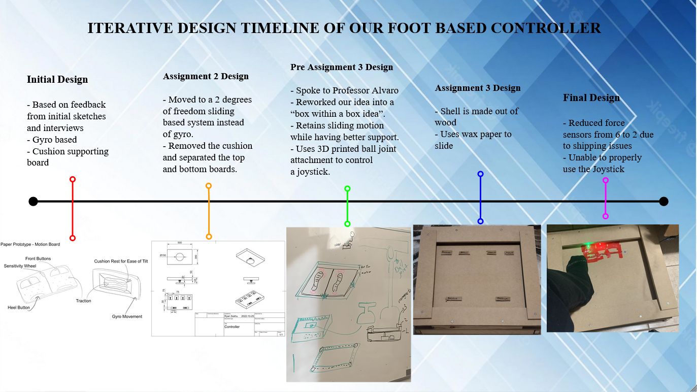

As you can see for the course project we had to abondon joystick input as our attempt
to 3D print an attachment did not work as you can see in the image below, and while 
we attempted to use a hook and rubber bands as an alterative, between the bands falling
off and the sliding causing the wires for the LEDs and Force Sensors to disconnect we it
simply became unfesable to support in the time we had. 

The result of our attempt to 3D print a ball joint attachment for the joystick 
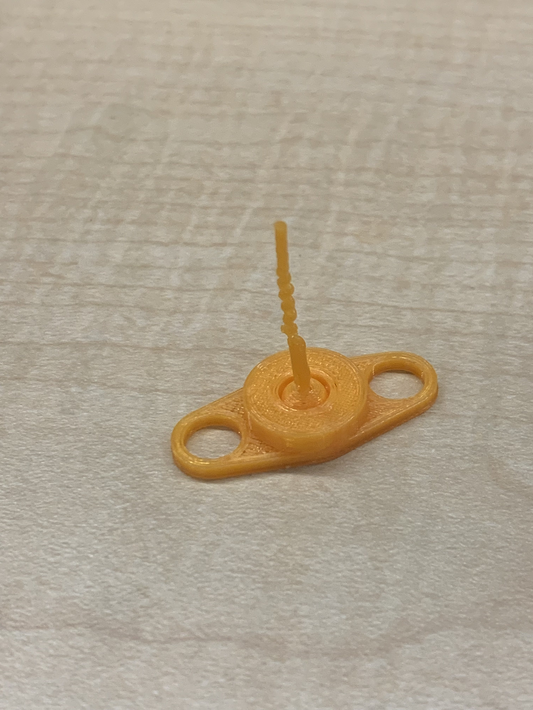

# Final Prototype

The following is 3 photos of the final prototype

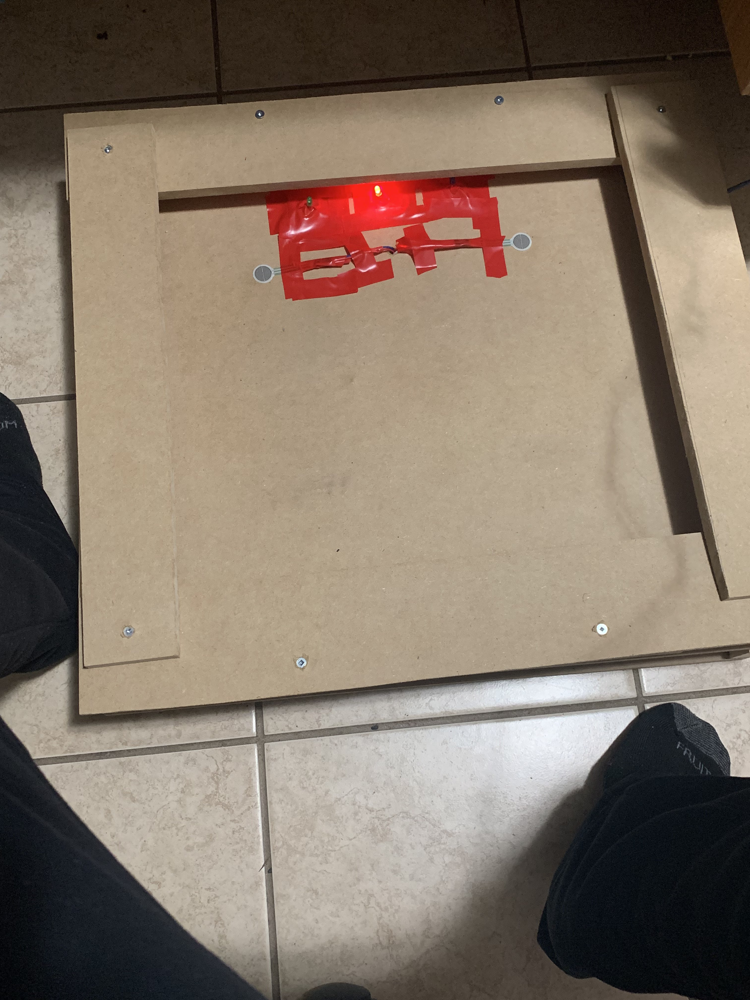
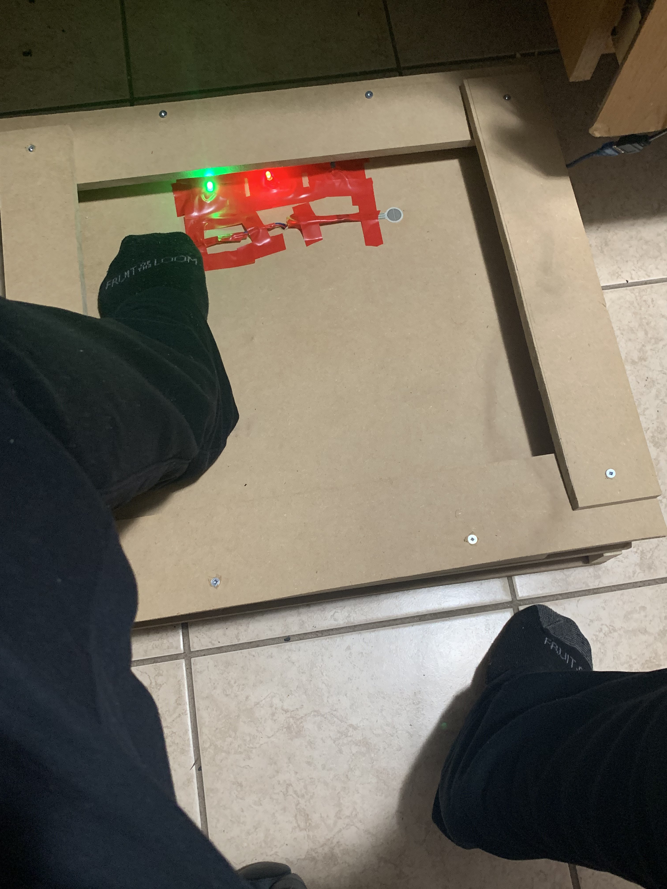
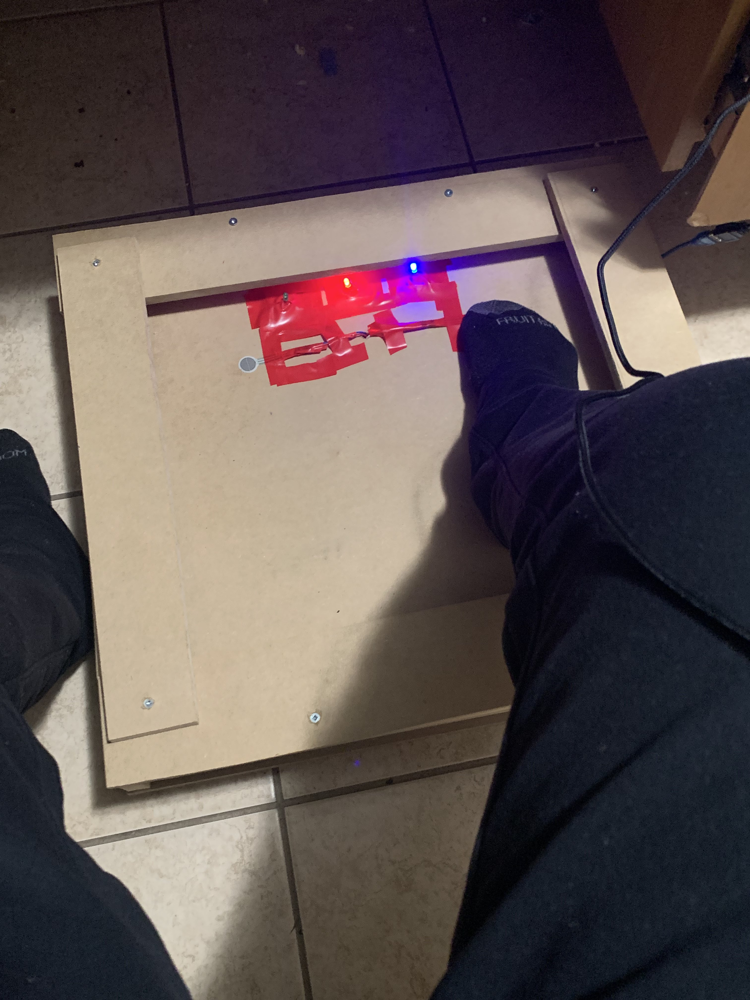

# Technical Drawings 

# Electronics

The following is the tinkercad wiring diagram, which shows how the wires are laid out, though 
many of the wires in the physical prototype are extended longer by chaining male/male and 
female/female wires together to accomdate the sheer scale of our prototype, and we had to 
mix and match colours due to running out of red, orange (which was used as a backup to red), 
and green male/male wires. 

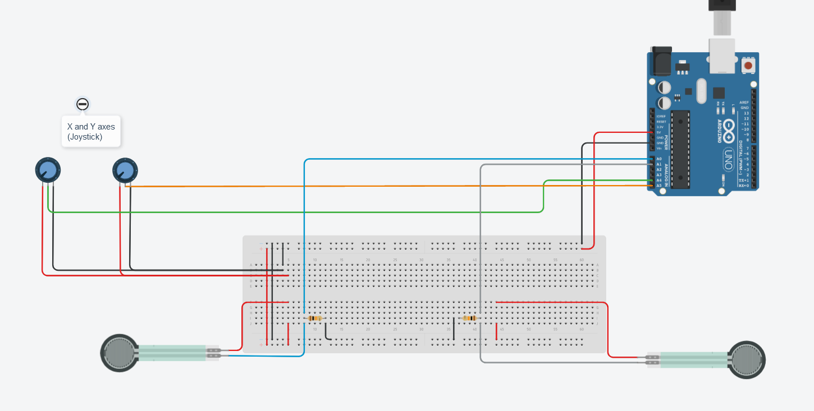

The following are some photos of the physical wiring, both before we put them into the 
prototype, and after we put them into the prototype but before placing the board back
down and connecting the wires togther.

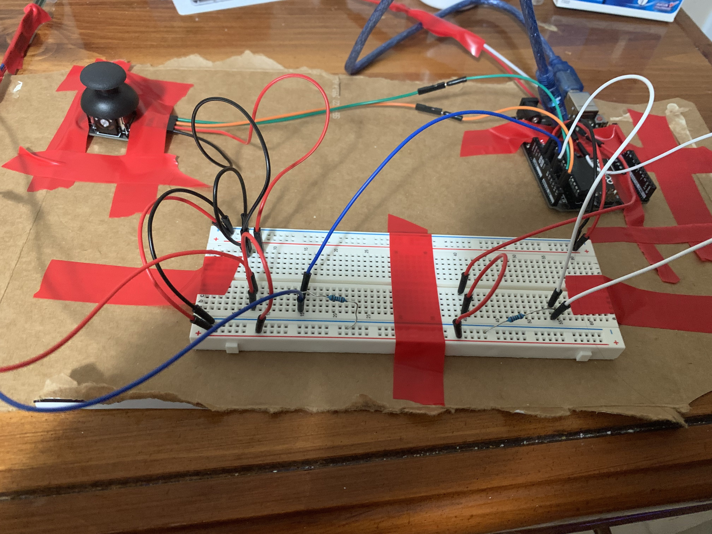
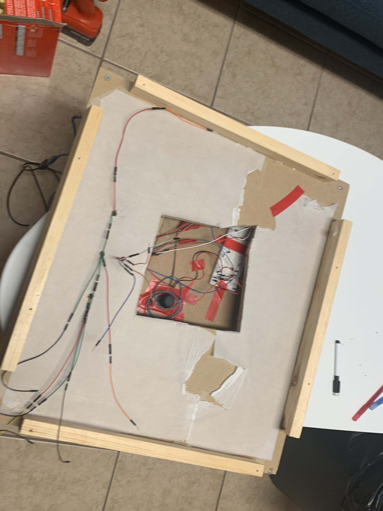
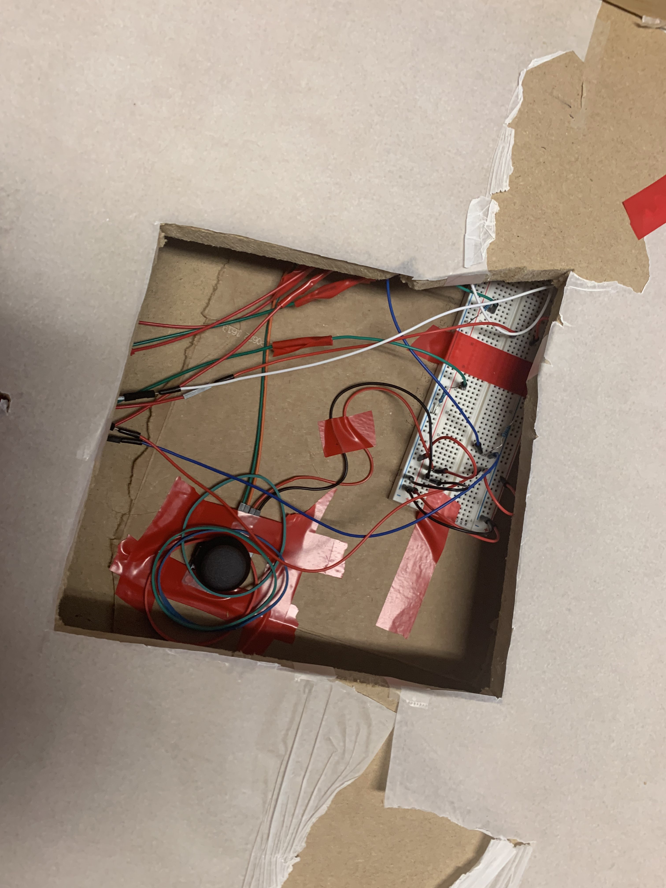
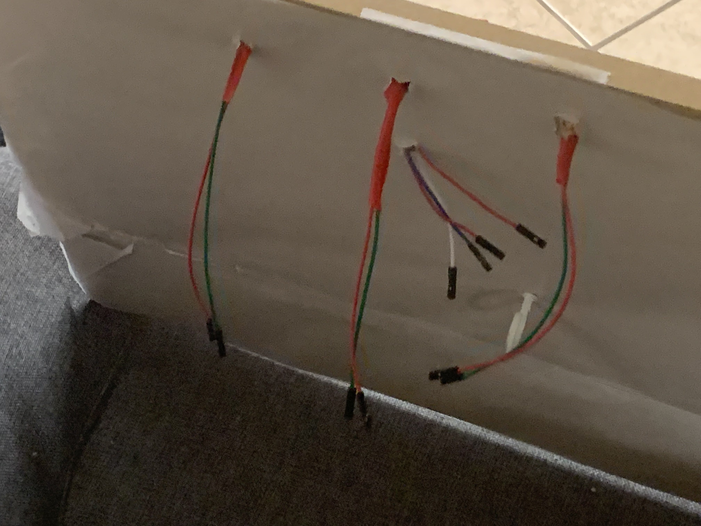

# Usability and QFD 

A quick summary of QFD, we compared ourselves to the 3D rudder, one of the main commerical
foot motion controller devices, and though we had to merely show users images and videos of 
the 3DRudder as we did not have access to a phyiscal one, they reported weight as being generally
important and well done on the device, while automatic recentering and low friction sliding was
rated as most important for our design. 

We were unable to implement recentring with the time we had, and while intially doing the QFD 
evaluation we were using wax paper which was relatively effective at reducing sliding friction,
both features ultimately became irrelevant when we had to abondon the joystick motion due to the 
3D printing, and wire disconnecting issues, but if we ever moved forward with the project they would
be high priority features to implement. 

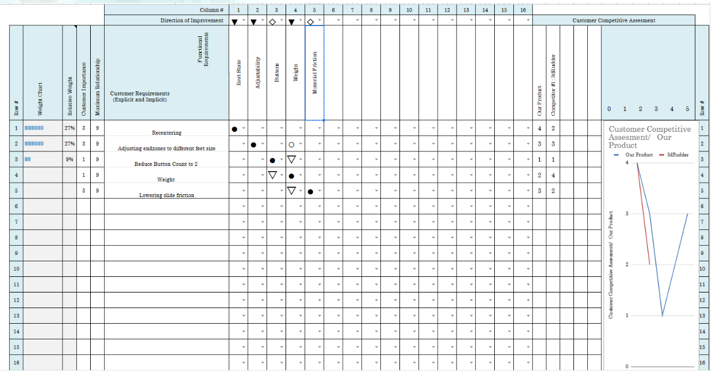
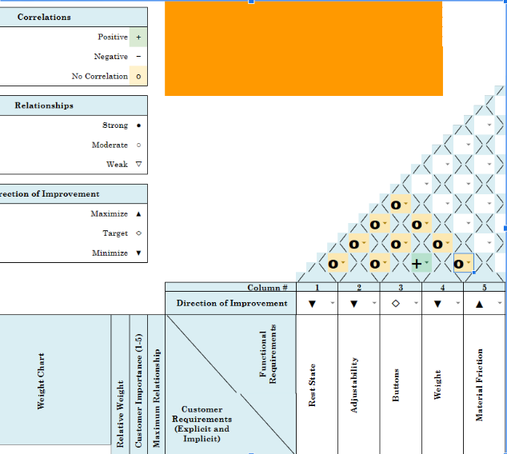

For our system usability scale (SUS), of the 8 people who filled out the survey, all but one 
outlier had a score of 70 or above, with the average of all the scores being 78.4375, a result
which indicates that people overall found our controller very usable.

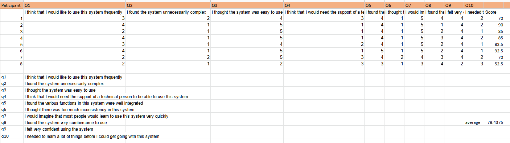

However we did note that the answers to question 1 in particular varied a lot, meaning our respondants
weren't sure if they'd use the device regularly even if it was a relatively simple and inituative to 
use, we believe this may have been because our respondants were all people with full use of both hands
and not our primary target audience.

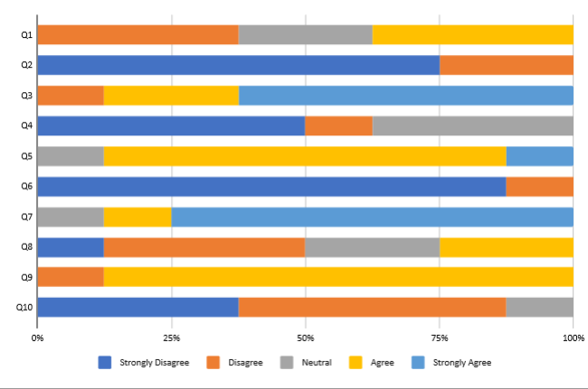

