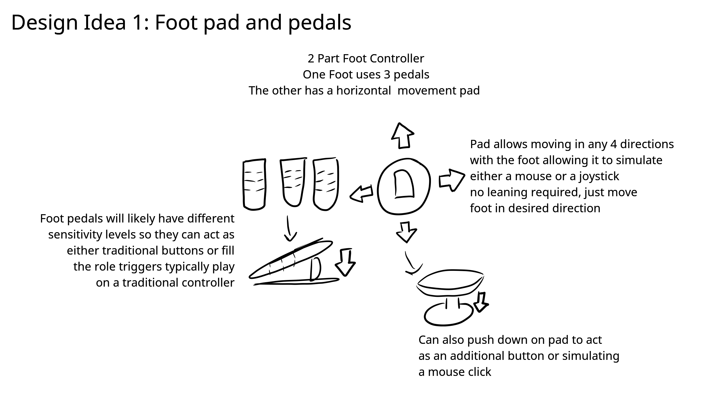
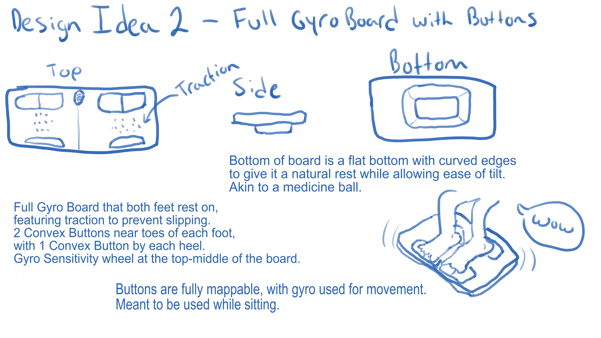
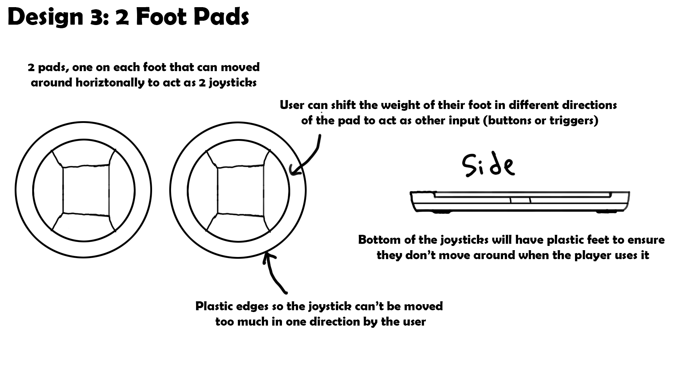
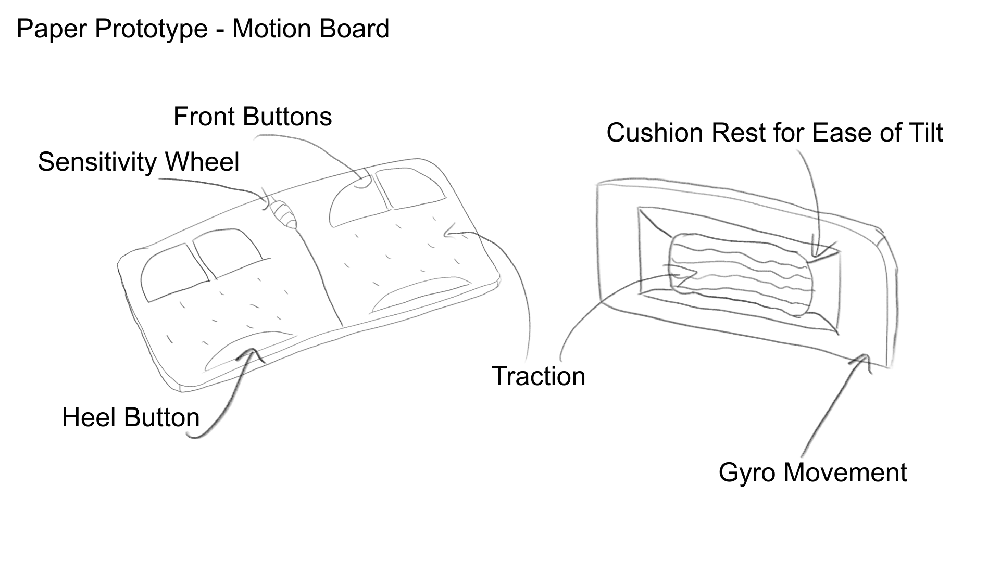
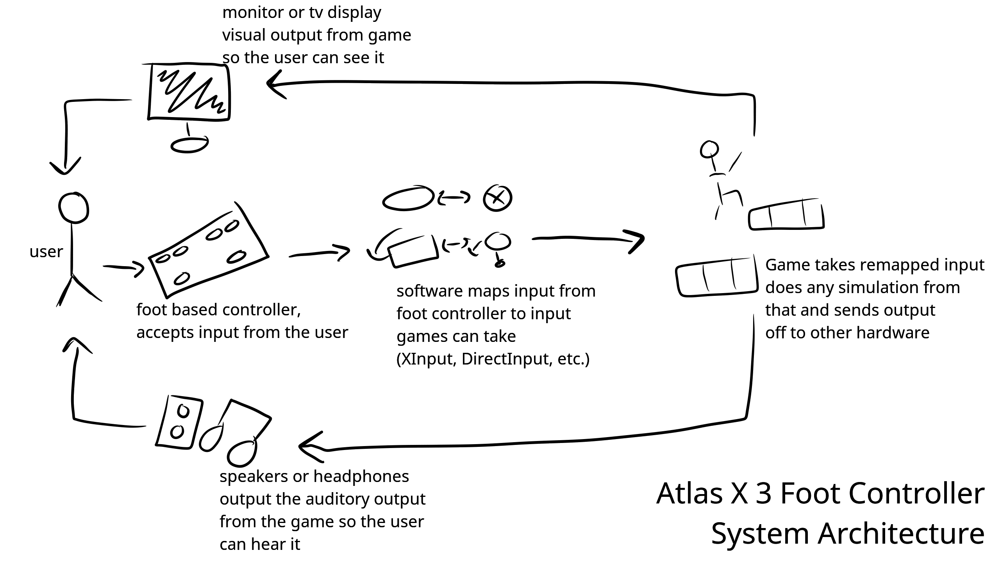
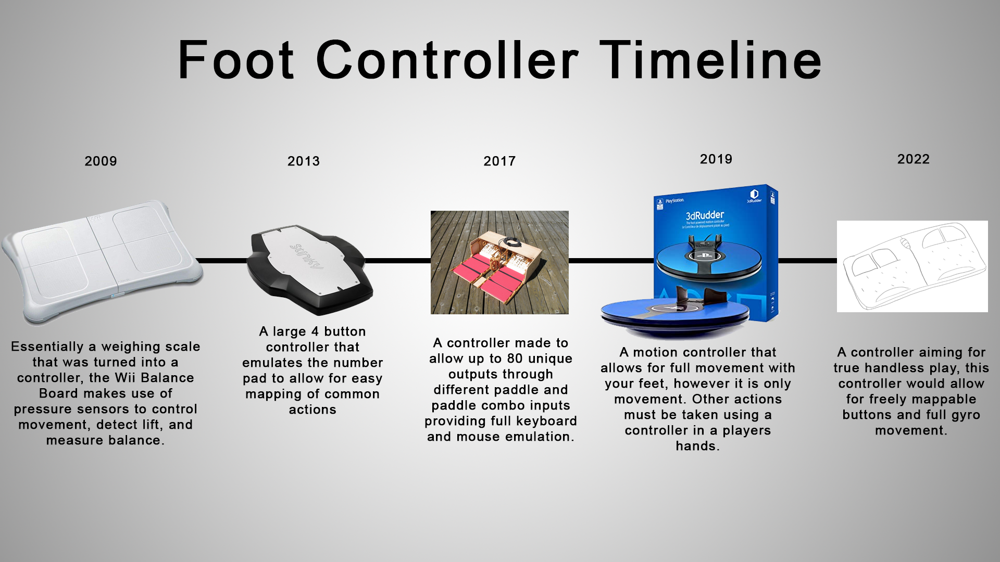

# INFR 3380U - Industrial Design For Game Hardware - Assignment 1

### A Foot Based Game Controller by Atlas X 3

Ame Gilham 100741352

Jackie Zhou 100750922

Ryan Sukhu 100600038

### Information

The written report and all in it's components can be found in the IEE Written Report.pdf file on this branch of the repository.
The video overview will be linked below, the slide deck can be found in the Video Overview Slide Deck.pdf file on this brach.
The report and overview have all of the relevant images but they are also included below. 

### Video Overview

Youtube link: [https://youtu.be/s5vlCxy95Cs](https://youtu.be/s5vlCxy95Cs "Youtube")

### Ideation Intial Sketches

### Paper Prototype

### System Architecture

### Product Comparison

