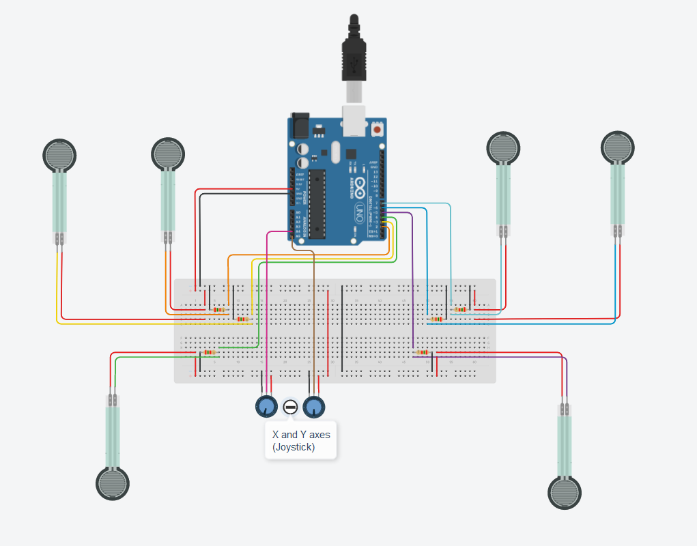
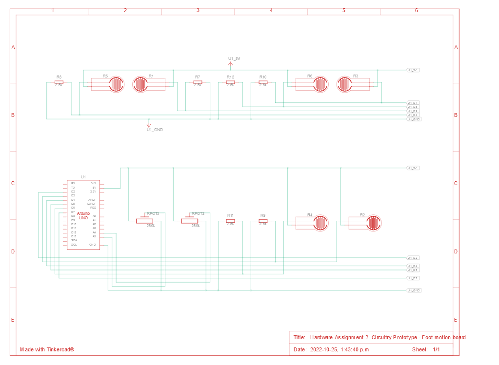
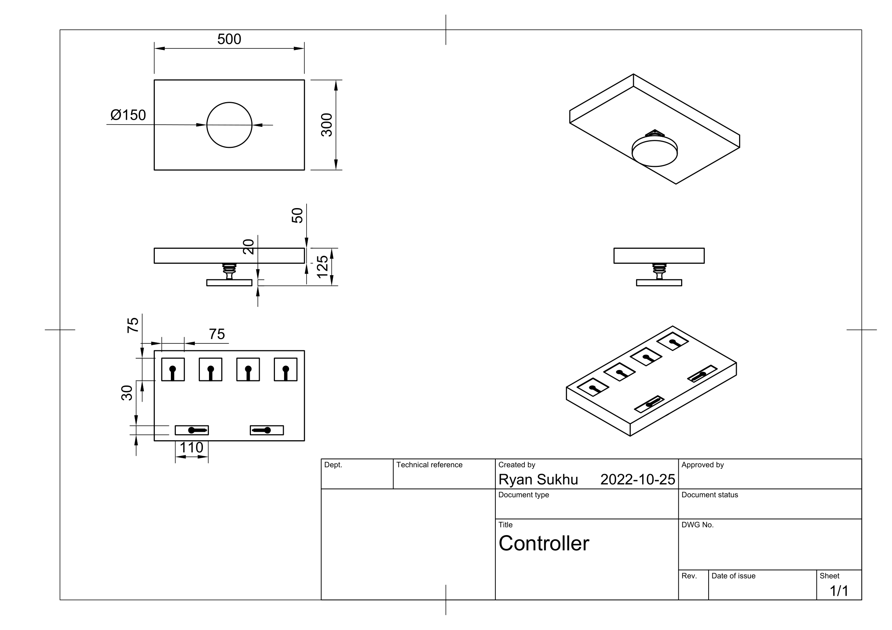
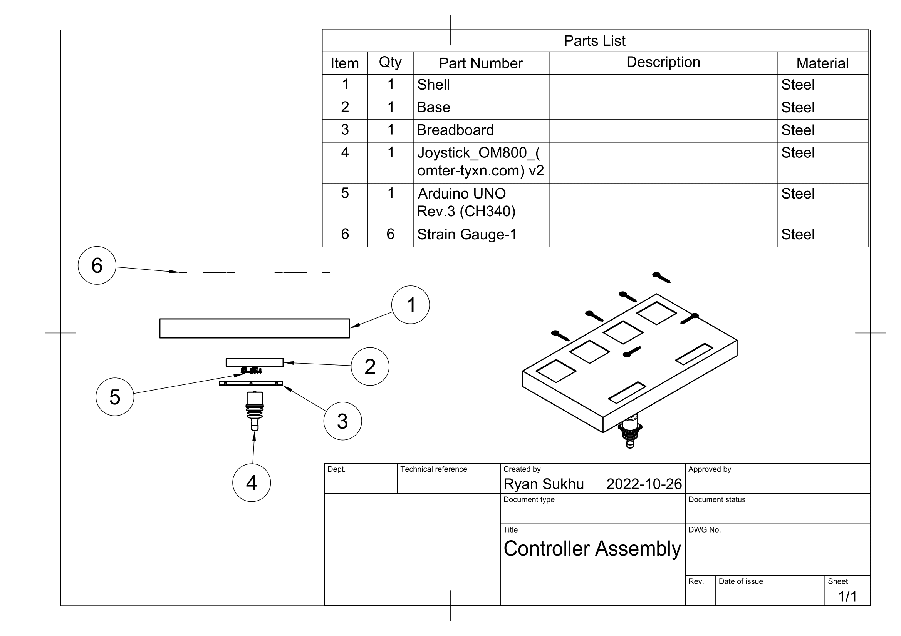

# INFR 3380U - Industrial Design For Game Hardware - Assignment 2

### A Foot Based Game Controller by Atlas X 3

Ame Gilham 100741352

Jackie Zhou 100750922

Ryan Sukhu 100600038

### Information
The step file for the models we build is the "Foot Based Controller.step" file in this repo, the slide deck is in the "Video Overview Slide Deck.pdf" file, the video overview itself is linked below, as is a video of the circuitry simulation, and a video of the exploded view anmimation. Images for the circuitry diagram, technical drawing, assembly technical drawing, and paper prototype are all below, as can both bills of materials.

### Video Overview
Youtube link: [link](link "Youtube")

### Electronic Schematics

### Circuitry Simulation

Youtube link: [https://youtu.be/n8SsyYlPhw0](https://youtu.be/n8SsyYlPhw0 "Youtube")

### Electronic Bill Of Materials

<table style="margin-left: auto; margin-right: auto;">
  <tr><th>Quantity</th>           <th>Component Name</th>                       <th>Description of Component</th></tr>
  <tr><td>1</td>   		  <td>Arduino Uno R3</td>                       <td>A microcontroller board that will be used to handle input and output.</td></tr>
  <tr><td>1</td>   		  <td>Breadboard</td>       	                <td>Used as a hub to organize the wires, resistors, etc.</td></tr>
  <tr><td>6</td>   		  <td>Force Sensor</td>               		<td>Sensor that will be used to detect and respond to pressure.</td></tr>
  <tr><td>6</td>   		  <td>Resistor</td>                   		<td>Used to increase or decrease the force sensor's sensing threshold.</td></tr>
  <tr><td>1</td>                  <td>Joystick</td>                   		<td>Will be used to gather input for x and y axes.</td></tr>
  <tr><td>38</td>                 <td>Male to Male Wire Connectors</td>       	<td>Used to connect various electronic components to the breadboard and Uno.</td></tr>
</table>
 

### Technical Drawings

### Assembly

### Exploded View Animation

Youtube link: [https://youtu.be/pIpWyCpzBi4](https://youtu.be/pIpWyCpzBi4 "Youtube")

### Paper Prototype

### Bill Of Materials

<table style="margin-left: auto; margin-right: auto;">
  <tr><th>Item #</th>           <tr><th>Quantity</th>           <th>Name</th>                       <th>Description of Component</th></tr>
  <tr><th>1</th>                <th>1</th>           	<th>Shell</th>                      <th>Contains the main electronic components and allows the user to interact with it.</th></tr>
  <tr><th>2</th>                <th>1</th>           	<th>Base</th>                       <th>Will hold the joystick and allow the shell to slide.</th></tr>
  <tr><th>3</th>                <th>1</th>           	<th>Breadboard</th>                 <th>Used as a hub to connect and organize the wires, resistors, etc.</th></tr>
  <tr><th>4</th>                <th>1</th>           	<th>Joystick</th>                   <th>Will be used to gather input for x and y axes.</th></tr>
  <tr><th>5</th>                <th>1</th>           	<th>Arduino Uno R3</th>             <th>A microcontroller board that will be used to handle input and output.</th></tr>
  <tr><th>6</th>                <th>6</th>           	<th>Force Sensor</th>               <th>Sensor that will be used to detect and respond to pressure.</th></tr>
</table>